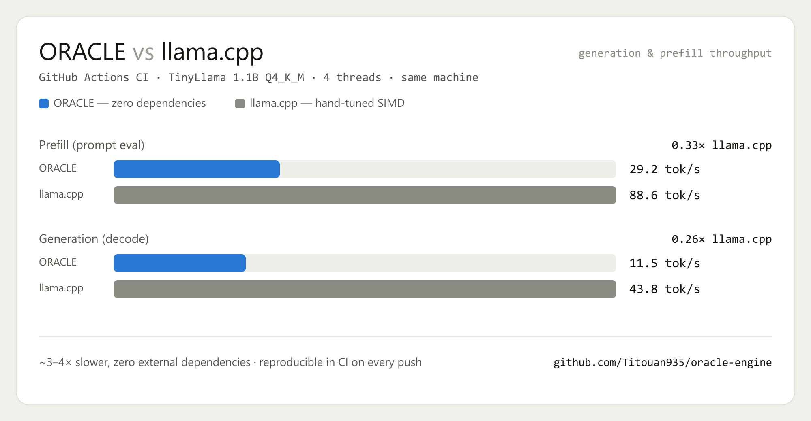

# Benchmarks

Every number below is produced by the reproducible harness in this repo and by
the `benchmark` GitHub Actions workflow — **anyone can re-run them**. Nothing is
hand-typed.

[](https://github.com/Titouan935/oracle-engine/actions/workflows/benchmark.yml)

## Results — GitHub Actions CI

- **Runner:** GitHub Actions `ubuntu-latest` (x86-64, 4 vCPU, AVX2/FMA)
- **Model:** TinyLlama-1.1B-Chat, Q4_K_M (llama arch)
- **Same machine, same model, same thread count (4) for both engines**
- **ORACLE:** greedy decode, weights preloaded, median of runs (1 warmup discarded)
- **llama.cpp:** `llama-bench` (built from source, same run)

| Engine | Prefill (tok/s) | Generation (tok/s) | Peak RSS |
|---|---|---|---|
| **ORACLE** | 29.2 | 11.5 | 1361 MB |
| llama.cpp | 88.6 | 43.8 | — |
| ratio | 0.33× | 0.26× | — |



ORACLE runs at roughly **0.3× llama.cpp — about 3–4× slower** — with **zero
external dependencies**, against llama.cpp's years of hand-tuned SIMD kernels.
That is the honest cost of writing every layer from scratch, and it is measured
in CI on every push (not a number I get to fudge).

## The engine is memory-bandwidth bound

Throughput scales with how fast the machine can read the model weights, not with
raw compute:

- The isolated quantized matmul kernel (`micro_gemm`) already runs at **~72
  GFLOP/s** on the CI runner — near the machine's compute ceiling. The full
  forward pass runs far below that: the time is in memory traffic, not the kernel.
- **Illustration:** the same engine on a low-power Intel Pentium Gold 8505
  (single-channel RAM, 1 performance core) runs a 3B model at ~1 tok/s generation
  — about **11× slower** than the CI runner above. Compute barely changed; memory
  bandwidth did. If your machine has fast memory, ORACLE is fast; if not, it isn't.

The `gemm_q` prefill kernel uses a token-tiled micro-kernel (4 tokens × 2 AVX2/NEON
accumulators, weights loaded once per 4 dot products): **+14%** on the kernel
(63 → 72 GFLOP/s in CI), correctness verified against a scalar reference.

## Method

`oracle_bench` measures prefill and generation **separately** and deterministically:

- **Prefill** — batched prompt processing (`forward_prefill`, weight-stationary GEMM).
- **Generation** — autoregressive decode, **greedy (argmax)** so the output is
  deterministic and independent of the sampler.
- **Peak RSS** — max resident set size of the process.

Protocol: fixed prompt, `-r` runs with the **median** reported (first run discarded
as warmup), KV cache reset before each run, thread count pinned with `-t`, and an
**FNV-1a checksum** of the generated tokens printed (two identical runs → same hash,
a determinism proof). Both engines use the same thread count.

## Reproduce

**In the cloud, for free (no local machine needed):** push to the repo, or run the
`benchmark` workflow from the Actions tab. Results appear in the job summary.

**Locally (macOS / Linux):**

```bash
make
# ORACLE, greedy, thread-matched:
./oracle_bench -m models/your-model.gguf -p 64 -g 32 -r 3 -t 4
# vs llama.cpp on the same machine/model/threads:
llama-bench -m models/your-model.gguf -p 64 -n 32 -r 3 -t 4
```

`benchmark/compare_llama.sh` automates the side-by-side and writes a merged table.
Note: give the model enough **free RAM** to load without paging (~2 GB for a 3B Q4),
otherwise the engine falls back to page-faulting mmap and throughput collapses.

## Honest notes

- ORACLE is **~3–4× slower than llama.cpp** on the same machine. That is the price
  of zero dependencies and a from-scratch implementation — llama.cpp has years of
  hand-tuned SIMD kernels and a much larger surface of optimizations. It is not
  hidden here; it is measured in CI on every push.
- The engine is **memory-bound**, not compute-bound: the quantized matmul kernel is
  already near the compute ceiling, so the remaining wins are in memory traffic.
- Numbers are on a 1.1B model for fast CI. Larger models shift the memory/compute
  balance; run the workflow with a different `model_url` to measure your own.
